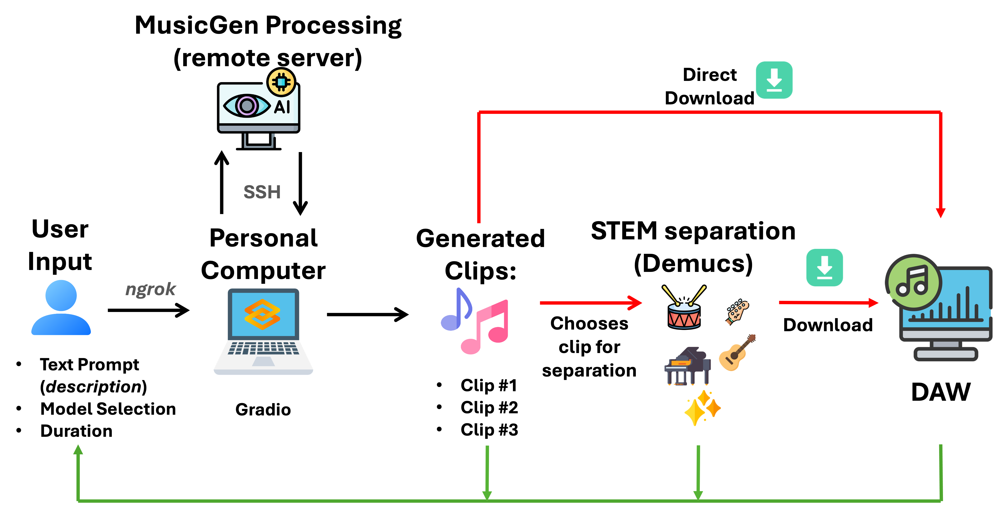

<div align="center">

# AI-Assisted Music Production: A User Study on Text-to-Music Models}

<!--  -->
 
[Francesca Ronchini](https://www.linkedin.com/in/francesca-ronchini/), [Luca Comanducci](https://www.linkedin.com/in/lucacomanducci/), [Simone Marcucci]() and [Fabio Antonacci](https://www.deib.polimi.it/ita/personale/dettagli/573870)

Dipartimento di Elettronica, Informazione e Bioingegneria - Politecnico di Milano<br>
Paper accepted @ 17th International Symposium on
Computer Music Multidisciplinary Research (CMMR25)
    
[](https://www.arxiv.org/abs/2509.23364)

</div>

- [Abstract](#abstract)
- [Install & Usage](#install--usage)
- [Link to additional material](#link-to-additional-material)

## Abstract
Text-to-music models have revolutionized the creative landscape, offering new possibilities for music creation. Yet their integration into musicians’ workflows remains underexplored. This paper presents a case study on how TTM models impact music production, based on a user study of their effect on producers' creative workflows. Participants produce tracks using a custom tool combining TTM and source separation models. Semi-structured interviews and thematic analysis reveal key challenges, opportunities, and ethical considerations. The findings offer insights into the transformative potential of TTMs in music production, as well as challenges in their real-world integration.



This README contains brief notes related to the supplementary material of the _AI-Assisted Music Production: A User Study on Text-to- Music Models_ paper. 

## Install & Usage
`interface_code_ai_music_production.py` contains the python code for executing interface.

Before running the code, make sure to install the proper environment, running the following command: 
```
conda env create -f env_demo.yaml
```

Once the environment is correctly installed, the demo can be run by simply typing 
```
python interface_code_ai_music_production.py
```
on a terminal and then connecting via browser on the port specified by the model.
Requires the installation of [audiocraft](https://github.com/facebookresearch/audiocraft) library, since the interface generates music using MusicGen and [demucs](https://github.com/facebookresearch/demucs) for source separation.


## Link to additional material

Additional material and audio samples are available on the [companion website](https://lucacoma.github.io/AiMusicProductionUserStudy/). 


If you use code or comments from this work, please cite our paper:
```
@inproceedings{ronchini2025aiassisted,
  title={AI-Assisted Music Production: A User Study on Text-to- Music Models},
  author={Ronchini, Francesca and Comanducci, Luca and Marcucci, Simone and Antonacci, Fabio},
  booktitle={17th International Symposium on Computer Music Multidisciplinary Research},
  year={2025}
}
```

