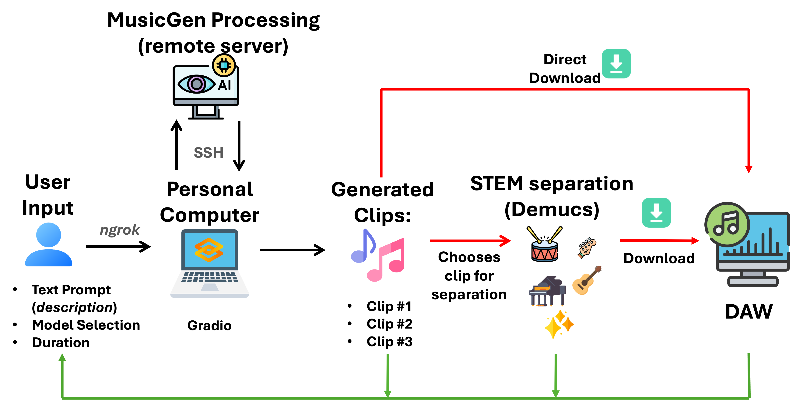

#### Abstract 
Text-to-music models have revolutionized the creative landscape, offering new possibilities for music creation. Yet their integration into musicians’ workflows remains underexplored. This paper presents a case study on how TTM models impact music production, based on a user study of their effect on producers' creative workflows. Participants produce tracks using a custom tool combining TTM and source separation models. Semi-structured interviews and thematic analysis reveal key challenges, opportunities, and ethical considerations. The findings offer insights into the transformative potential of TTMs in music production, as well as challenges in their real-world integration.

## Additional material
In this page, we report media taken from some of the anonymized users that took part in the experiment. For each of these, we show:
- videos describing the workflow.
- tracks generated using the interface.
- the final track generated by all users.
N.B. some videos are muted to preserve the anonymity of the participants.

###  *User 251415*

<video width="640" height="480" controls loop="" autoplay="">
<source src="https://github.com/lucacoma/AiMusicProductionUserStudy/raw/refs/heads/main/docs/media/12)%20%23ID_251415/interaction_example_video_251415_excerpt_1.mp4">
</video>

<video width="640" height="480" controls loop="" autoplay="">
<source src="https://github.com/lucacoma/AiMusicProductionUserStudy/raw/refs/heads/main/docs/media/12)%20%23ID_251415/interaction_example_video_251415_excerpt_2.mp4">
</video>

### Text-to-music created loops
<audio controls style="width: 300px;"><source src="https://github.com/lucacoma/AiMusicProductionUserStudy/raw/refs/heads/main/docs/media/12)%20%23ID_251415/musicgen_created_loops_251415/bass_drum_3.wav" type="audio/mpeg"></audio>

<audio controls style="width: 300px;"><source src="https://github.com/lucacoma/AiMusicProductionUserStudy/raw/refs/heads/main/docs/media/12)%20%23ID_251415/musicgen_created_loops_251415/piano_take1.wav" type="audio/mpeg"></audio>

### Final Track

<audio controls style="width: 300px;"><source src="https://github.com/lucacoma/AiMusicProductionUserStudy/raw/refs/heads/main/docs/media/12)%20%23ID_251415/final_audio_track_251415.mp3" type="audio/mpeg"></audio>

###  *User 121415*

<video width="640" height="480" controls loop="" autoplay="">
<source src="https://github.com/lucacoma/AiMusicProductionUserStudy/raw/refs/heads/main/docs/media/5)%20%23ID_121415/interaction_example_videot_121415_excerp_1.mp4">
</video>

<video width="640" height="480" controls loop="" autoplay="">
<source src="https://github.com/lucacoma/AiMusicProductionUserStudy/raw/refs/heads/main/docs/media/5)%20%23ID_121415/interaction_example_video_121415_excerp_2.mp4">
</video>

### Text-to-music created loops
<audio controls style="width: 300px;"><source src="https://github.com/lucacoma/AiMusicProductionUserStudy/raw/refs/heads/main/docs/media/5)%20%23ID_121415/musicgen_created_loops_121415/drums.wav"></audio>

<audio controls style="width: 300px;"><source src="https://github.com/lucacoma/AiMusicProductionUserStudy/raw/refs/heads/main/docs/media/5)%20%23ID_121415/musicgen_created_loops_121415/output_0_session_2025-02-12_14-22-41.wav" type="audio/mpeg"></audio>

<audio controls style="width: 300px;"><source src="https://github.com/lucacoma/AiMusicProductionUserStudy/raw/refs/heads/main/docs/media/5)%20%23ID_121415/musicgen_created_loops_121415/output_1_session_2025-02-12_14-22-41.wav" type="audio/mpeg"></audio>

### Final Track

<audio controls style="width: 300px;"><source src="https://github.com/lucacoma/AiMusicProductionUserStudy/raw/refs/heads/main/docs/media/5)%20%23ID_121415/final_audio_track_121415.mp3"></audio>

###  *User 121517*

<video width="640" height="480" controls loop="" autoplay="">
<source src="https://github.com/lucacoma/AiMusicProductionUserStudy/raw/refs/heads/main/docs/media/6)%20%23ID_121517/interaction_example_video_121517_excerpt_1.mp4">
</video>

<video width="640" height="480" controls loop="" autoplay="">
<source src="https://github.com/lucacoma/AiMusicProductionUserStudy/raw/refs/heads/main/docs/media/6)%20%23ID_121517/interaction_example_video_121517_excerpt_2.mp4">
</video>

<video width="640" height="480" controls loop="" autoplay="">
<source src="https://github.com/lucacoma/AiMusicProductionUserStudy/raw/refs/heads/main/docs/media/6)%20%23ID_121517/interaction_example_video_121517_excerpt_3.mp4">
</video>

### Text-to-music created loops
<audio controls style="width: 300px;"><source src="https://github.com/lucacoma/AiMusicProductionUserStudy/blob/main/docs/media/6)%20%23ID_121517/musicgen_created_loops_121517/Agile%20Synth%20Bass_1.wav"></audio>

<audio controls style="width: 300px;"><source src="https://github.com/lucacoma/AiMusicProductionUserStudy/raw/refs/heads/main/docs/media/6)%20%23ID_121517/musicgen_created_loops_121517/Gentle%20Sine%20Bells_1.wav" type="audio/mpeg"></audio>

<audio controls style="width: 300px;"><source src="https://github.com/lucacoma/AiMusicProductionUserStudy/raw/refs/heads/main/docs/media/6)%20%23ID_121517/musicgen_created_loops_121517/MusicGen%20Final.wav"></audio>

<audio controls style="width: 300px;"><source src="https://github.com/lucacoma/AiMusicProductionUserStudy/raw/refs/heads/main/docs/media/6)%20%23ID_121517/musicgen_created_loops_121517/drums_1.wav" type="audio/mpeg"></audio>

<audio controls style="width: 300px;"><source src="https://github.com/lucacoma/AiMusicProductionUserStudy/raw/refs/heads/main/docs/media/6)%20%23ID_121517/musicgen_created_loops_121517/guitar_1.wav" type="audio/mpeg"></audio>

### Final Track

<audio controls style="width: 300px;"><source src="https://github.com/lucacoma/AiMusicProductionUserStudy/raw/refs/heads/main/docs/media/6)%20%23ID_121517/final_audio_track_121517.wav"></audio>

###  *User 171718*

<video width="640" height="480" controls loop="" autoplay="">
<source src="https://github.com/lucacoma/AiMusicProductionUserStudy/raw/refs/heads/main/docs/media/8)%20%23ID_171718/interaction_example_video_171718_excerpt_1.mp4">
</video>

### Text-to-music created loops
<audio controls style="width: 300px;"><source src="https://github.com/lucacoma/AiMusicProductionUserStudy/raw/refs/heads/main/docs/media/8)%20%23ID_171718/musicgen_created_loops_171718/bass%20(1).wav"></audio>

<audio controls style="width: 300px;"><source src="https://github.com/lucacoma/AiMusicProductionUserStudy/raw/refs/heads/main/docs/media/8)%20%23ID_171718/musicgen_created_loops_171718/bass%20(2).wav"></audio>

<audio controls style="width: 300px;"><source src="https://github.com/lucacoma/AiMusicProductionUserStudy/raw/refs/heads/main/docs/media/8)%20%23ID_171718/musicgen_created_loops_171718/bass.wav"></audio>

<audio controls style="width: 300px;"><source src="https://github.com/lucacoma/AiMusicProductionUserStudy/raw/refs/heads/main/docs/media/8)%20%23ID_171718/musicgen_created_loops_171718/drums%20(1).wav"></audio>

<audio controls style="width: 300px;"><source src="https://github.com/lucacoma/AiMusicProductionUserStudy/raw/refs/heads/main/docs/media/8)%20%23ID_171718/musicgen_created_loops_171718/drums.wav"></audio>

<audio controls style="width: 300px;"><source src="https://github.com/lucacoma/AiMusicProductionUserStudy/raw/refs/heads/main/docs/media/8)%20%23ID_171718/musicgen_created_loops_171718/guitar.wav"></audio>

<audio controls style="width: 300px;"><source src="https://github.com/lucacoma/AiMusicProductionUserStudy/raw/refs/heads/main/docs/media/8)%20%23ID_171718/musicgen_created_loops_171718/guitar%20(1).wav"></audio>

<audio controls style="width: 300px;"><source src="https://github.com/lucacoma/AiMusicProductionUserStudy/raw/refs/heads/main/docs/media/8)%20%23ID_171718/musicgen_created_loops_171718/guitar%20(2).wav"></audio>

<audio controls style="width: 300px;"><source src="https://github.com/lucacoma/AiMusicProductionUserStudy/raw/refs/heads/main/docs/media/8)%20%23ID_171718/musicgen_created_loops_171718/other.wav"></audio>

<audio controls style="width: 300px;"><source src="https://github.com/lucacoma/AiMusicProductionUserStudy/raw/refs/heads/main/docs/media/8)%20%23ID_171718/musicgen_created_loops_171718/other%20(1).wav"></audio>

<audio controls style="width: 300px;"><source src="https://github.com/lucacoma/AiMusicProductionUserStudy/raw/refs/heads/main/docs/media/8)%20%23ID_171718/musicgen_created_loops_171718/other%20(2).wav"></audio>

<audio controls style="width: 300px;"><source src="https://github.com/lucacoma/AiMusicProductionUserStudy/raw/refs/heads/main/docs/media/8)%20%23ID_171718/musicgen_created_loops_171718/other%20(3).wav"></audio>

<audio controls style="width: 300px;"><source src="https://github.com/lucacoma/AiMusicProductionUserStudy/raw/refs/heads/main/docs/media/8)%20%23ID_171718/musicgen_created_loops_171718/other%20(4).wav"></audio>

<audio controls style="width: 300px;"><source src="https://github.com/lucacoma/AiMusicProductionUserStudy/raw/refs/heads/main/docs/media/8)%20%23ID_171718/musicgen_created_loops_171718/output_0_session_2025-02-17_17-51-55%20(1).wav" type="audio/mpeg"></audio>

<audio controls style="width: 300px;"><source src="https://github.com/lucacoma/AiMusicProductionUserStudy/raw/refs/heads/main/docs/media/8)%20%23ID_171718/musicgen_created_loops_171718/output_0_session_2025-02-17_17-51-55.wav" type="audio/mpeg"></audio>

<audio controls style="width: 300px;"><source src="https://github.com/lucacoma/AiMusicProductionUserStudy/raw/refs/heads/main/docs/media/8)%20%23ID_171718/musicgen_created_loops_171718/output_1_session_2025-02-17_17-51-55.wav" type="audio/mpeg"></audio>

<audio controls style="width: 300px;"><source src="https://github.com/lucacoma/AiMusicProductionUserStudy/raw/refs/heads/main/docs/media/8)%20%23ID_171718/musicgen_created_loops_171718/output_2_session_2025-02-17_17-51-55%20(1).wav" type="audio/mpeg"></audio>

<audio controls style="width: 300px;"><source src="https://github.com/lucacoma/AiMusicProductionUserStudy/raw/refs/heads/main/docs/media/8)%20%23ID_171718/musicgen_created_loops_171718/output_2_session_2025-02-17_17-51-55.wav" type="audio/mpeg"></audio>

<audio controls style="width: 300px;"><source src="https://github.com/lucacoma/AiMusicProductionUserStudy/raw/refs/heads/main/docs/media/8)%20%23ID_171718/musicgen_created_loops_171718/piano.wav" type="audio/mpeg"></audio>

<audio controls style="width: 300px;"><source src="https://github.com/lucacoma/AiMusicProductionUserStudy/raw/refs/heads/main/docs/media/8)%20%23ID_171718/musicgen_created_loops_171718/piano%20(1).wav" type="audio/mpeg"></audio>

<audio controls style="width: 300px;"><source src="https://github.com/lucacoma/AiMusicProductionUserStudy/raw/refs/heads/main/docs/media/8)%20%23ID_171718/musicgen_created_loops_171718/piano%20(2).wav" type="audio/mpeg"></audio>

<audio controls style="width: 300px;"><source src="https://github.com/lucacoma/AiMusicProductionUserStudy/raw/refs/heads/main/docs/media/8)%20%23ID_171718/musicgen_created_loops_171718/piano%20(3).wav" type="audio/mpeg"></audio>

<audio controls style="width: 300px;"><source src="https://github.com/lucacoma/AiMusicProductionUserStudy/raw/refs/heads/main/docs/media/8)%20%23ID_171718/musicgen_created_loops_171718/piano%20(4).wav" type="audio/mpeg"></audio>

<audio controls style="width: 300px;"><source src="https://github.com/lucacoma/AiMusicProductionUserStudy/raw/refs/heads/main/docs/media/8)%20%23ID_171718/musicgen_created_loops_171718/piano%20(5).wav" type="audio/mpeg"></audio>

### Final Track

<audio controls style="width: 300px;"><source src="https://github.com/lucacoma/AiMusicProductionUserStudy/raw/refs/heads/main/docs/media/8)%20%23ID_171718/final_audio_track_171718.mp3"></audio>
